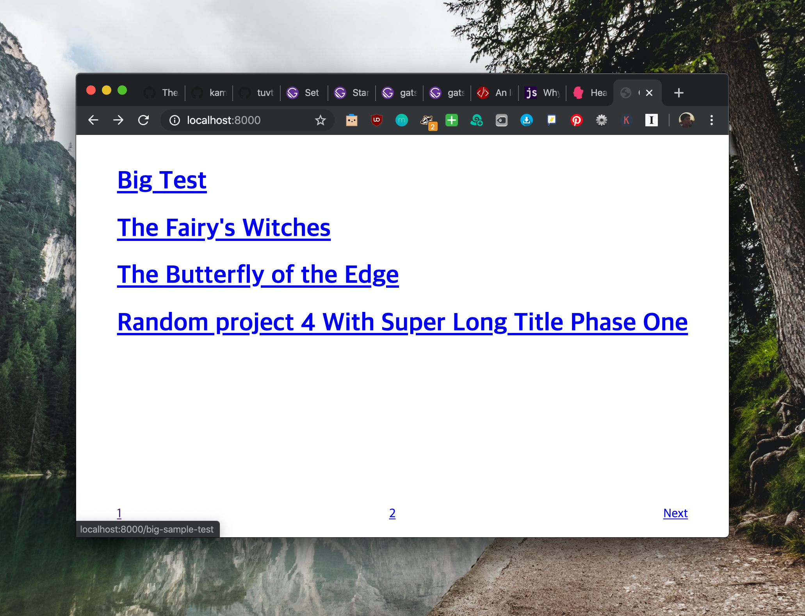

Building a blog with GatsbyJS starts from a command line. Because it’s based on Node, you need to install Homebrew then install Node with Homebrew.

Since I am a Mac user, I will follow instruction described on Gatsby tutorial. This is what I did:

1. Install Homebrew
2. Install Xcode Command Line Tools
3. Install Node.js and npm
4. Install Git
5. Install Gatsby CLI

Gatsby CLI collect data anonymously but since I don’t want that, I will opt-out for the data collection.


```Shell
gatsby telemetry --disable
```

Now we can install starter template from Gatsby CLI. There are many options to start blogging. This made me think. Even though I previously said that I would learn structure of my blog and its structure, in ands out, but is it really worth going through all the hassles of installing and learning about dependencies and plugins for Gatsby?

Well, since I am not trying to be a web programmer, I will install [gatsby-advanced-starter](https://www.gatsbyjs.org/starters/Vagr9K/gatsby-advanced-starter/) and learn what plugins are for and how they are used. Then I will start digging what to do for look of the site. One thing to note is that since I am not interested in using cms for the moment, I will uninstall netlify-cms-app plugin. What each plugin is for will be treated in another post. Let’s pull a skeleton blog!


```Shell
gatsby new blog-yoonoh https://github.com/Vagr9K/gatsby-advanced-starter
```


```Shell

.
..
...

npm WARN gatsby-starter-advanced@1.1.0 No repository field.

added 2743 packages from 1141 contributors and audited 33162 packages in 98.977s
found 0 vulnerabilities

info Initialising git in blog-yoonoh
Initialized empty Git repository in /Users/yoonseokoh/Documents/blogging/blog-yoonoh/.git/
info Create initial git commit in blog-yoonoh
info
Your new Gatsby site has been successfully bootstrapped. Start developing it by
running:
  $ cd blog-yoonoh
  $ gatsby develop
  ..
```


It even initialise git! Let’s build.


```Shell
$ gatsby develop

.
..
...

DONE  Compiled successfully in 11131ms                               8:12:29 PM
⠀
 I  Netlify CMS is running at http://localhost:8000/admin/
⠀
You can now view gatsby-starter-advanced in the browser.
⠀
  http://localhost:8000/
⠀
View GraphiQL, an in-browser IDE, to explore your site's data and schema
⠀
  http://localhost:8000/___graphql
⠀
Note that the development build is not optimized.
To create a production build, use gatsby build
⠀
success Building development bundle - 12.662s

```


<center>Voilà!</center>




We can see that unoptimized building for the purpose of develop takes around 12 seconds. For the moment, it seems it’s maginial for 300 mins included for free tier in Netlify. We will see how adding UI as well as optimizing for production would alter building time.

Before deleting netlify cms plugin, let’s fix warnings first.


```bash
...
warn gatsby-plugin-feed was initialized in gatsby-config.js without a title in a
 feed.
This means that the plugin will use the default feed title, which may not match
your use case.
...
warn unable to find prism language 'no-highlight' for highlighting. applying
warn code block or inline code language not specified in markdown. applying
...
```


For the first warning, we have to add title to rss feed option.


```javascript
{
      resolve: "gatsby-plugin-feed",
      options: {
      
        ...
        
        },
        
        ...
        
        feeds: [
          {
            serialize(ctx) {
              const { rssMetadata } = ctx.query.site.siteMetadata;
              return ctx.query.allMarkdownRemark.edges.map(edge => ({
                categories: edge.node.frontmatter.tags,
                date: edge.node.fields.date,
                title: edge.node.frontmatter.title,
                description: edge.node.excerpt,
                url: rssMetadata.site_url + edge.node.fields.slug,
                guid: rssMetadata.site_url + edge.node.fields.slug,
                custom_elements: [
                  { "content:encoded": edge.node.html },
                  { author: config.userEmail }
                ]
              }));
            },
            query: `
            {
            
            ...
            
            }
          `,
            output: config.siteRss,
  Add this: title: `${config.siteTitle} RSS Feed`
          }
        ]
      }
    }
```


In order to see the feed in action, we have to build the site and serve it.


```Shell
$ gatsby build && gatsby serve
```

This time, the site is ported to 9000.


It works! Also, you cannot see in the screenshot above, but title comes out as the site’s name. If you followed until this page, you will notice that it takes more than 100 seconds to build the blog. I am currently using 2015 MacBook Pro 13 inches no upgrade of CPU and RAM. I am not sure what’s the computational power will be for Netlify but anyone can be sure it can be tight after adding lots of stuffs on the blog.

Going back to the warnings before, one can simply delete warning signs by deleting posts in the `./content/` that contain a code block. Warnings were generated because some code blocks had `no-highlight` syntax which could not be parsed. Make sure to leave at least one post because otherwise it wouldn’t even build.

Now let’s uninstall Netlify CMS from the blog. From the `Gatsby-config.js` file, delete the following section


```javascript
...
		{
      resolve: "gatsby-plugin-netlify-cms",
      options: {
        modulePath: path.resolve("src/netlifycms/index.js"), // default: undefined
        enableIdentityWidget: true,
        publicPath: "admin",
        htmlTitle: "Content Manager",
        includeRobots: false
      }
    },
...
```


And delete the following files:


```bash
./static/admin/config.yml
./src/netlifycms
```


Now it’s all set to start building and configuring!