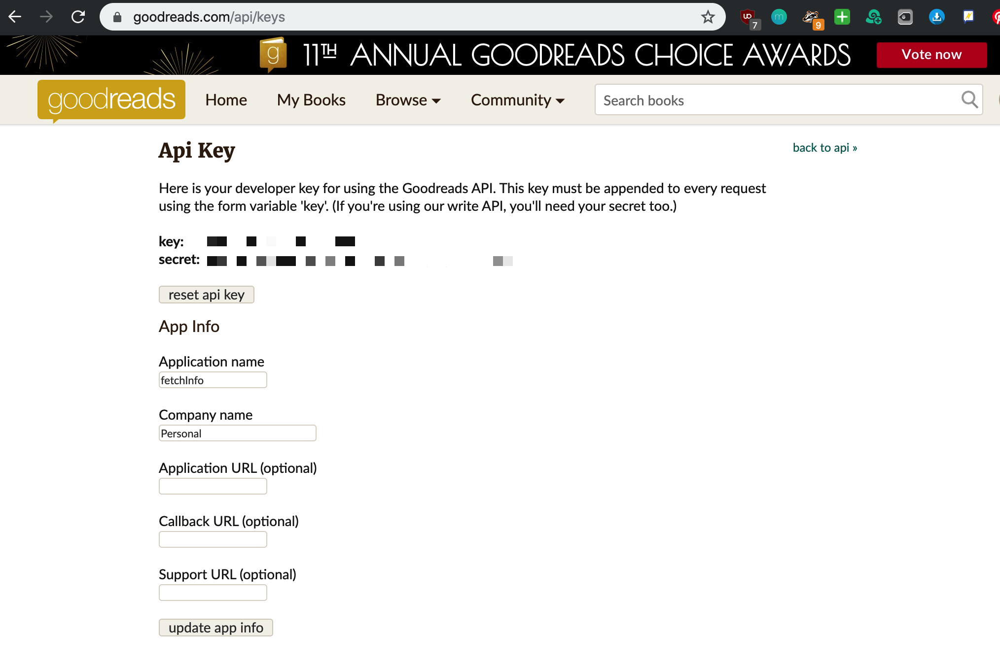
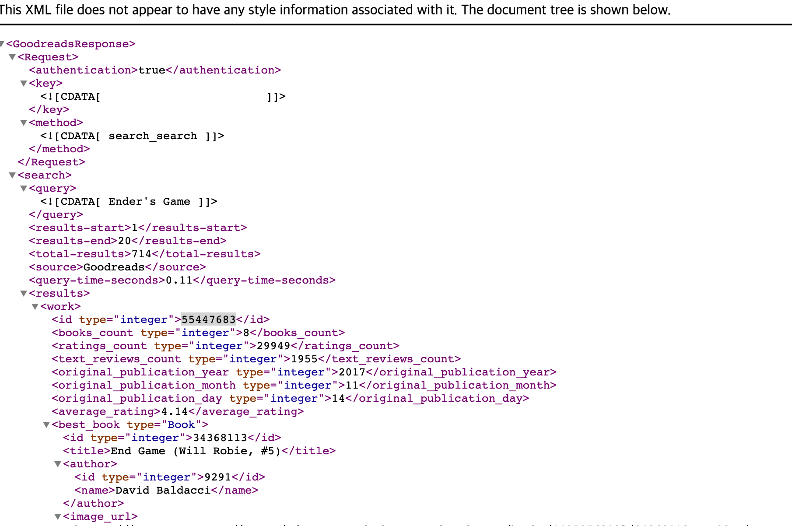
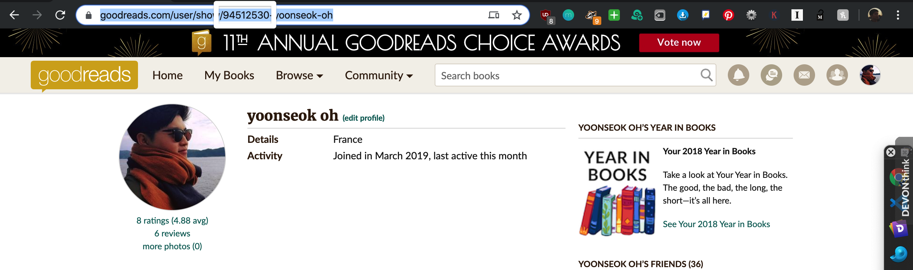
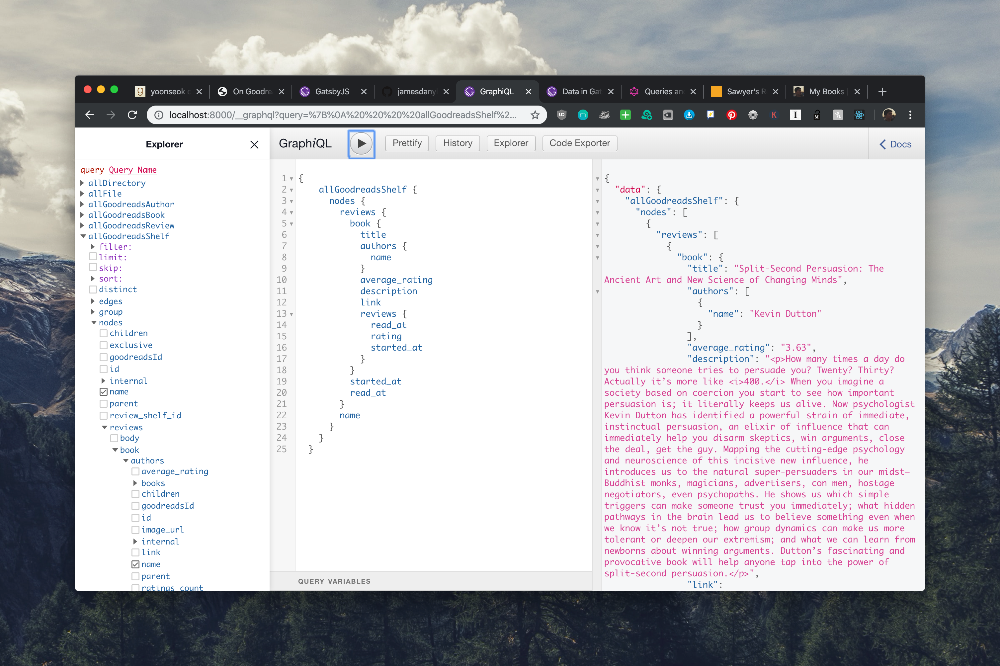
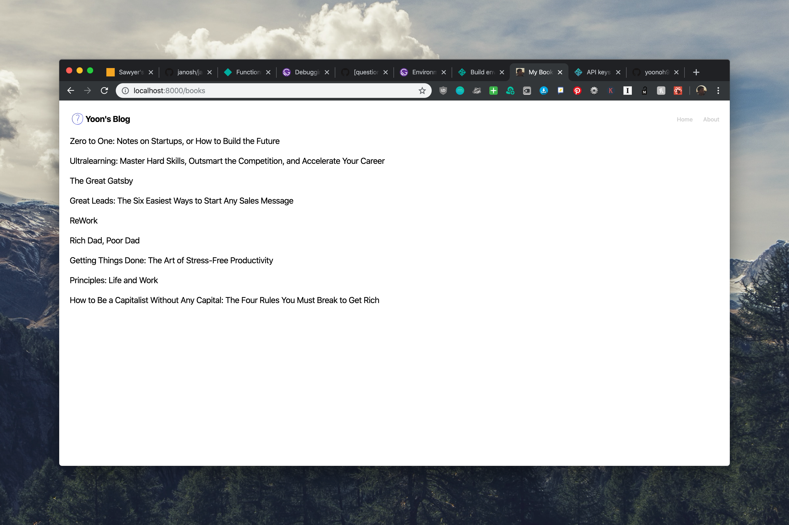
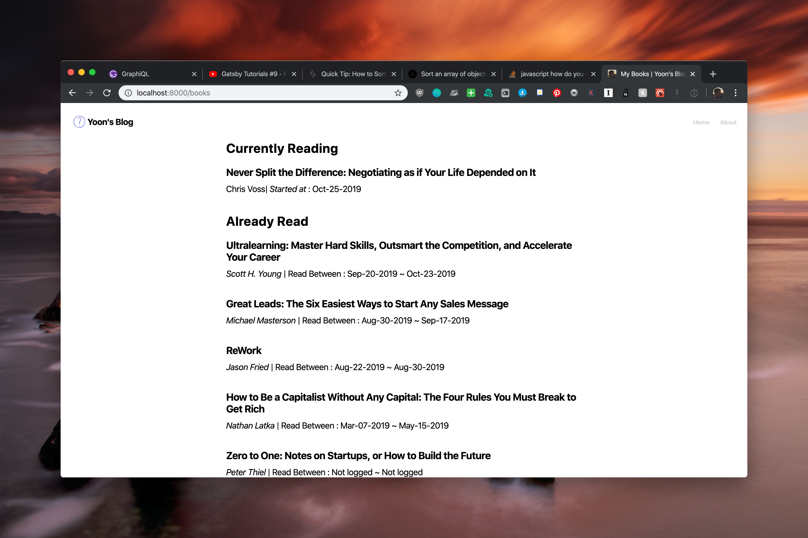

Ever since I got a kindle, I was able to read much more. More than being able to read more often, I can share books I am reading as well as highlights from books. Goodreads have been a good companion for this purpose. 

Since I’ve started blogging, I wanted to extend how I share about books I am reading and have read. This [blog](https://highlights.sawyerh.com/) by Sawyer is very good example for this purpose. I don’t want to complicate the process like Sawyer did in his blog post. Just simple data pulling through goodreads api and showing what I’ve read and currently reading is good enough for my blog. 

First, get personal API from [goodreads api web page](https://goodreads.com/api/keys).




You can check if the key number you received work fine by copy and pasting the following code to URL query on your browser.

```
## Replace YOUR_API_KEY with your api key generated from goodreads API page.
https://www.goodreads.com/search.xml?key=YOUR_API_KEY&q=Ender%27s+Game
```


As you can see, it works perfectly fine.




You can fetch your goodreads id integer value from your own profile. When you are at your profile, you can see the following url address on the website.



The boxed integer value is your goodreads id! 

!! Make sure that your shelves are public. If private, gatsby plugin that will be installed in the following section cannot fetch data.

You have your id, API key and API secret key, you can install Gatsby-plugin to fetch goodreads data to Graphql node.


```bash
npm install --save @jamesdanylik/gatsby-source-goodreads
```


Also add configuration:


```js
// In your gatsby-config.js
plugins: [
	{
	      resolve: "@jamesdanylik/gatsby-source-goodreads",
	      options: {
						key: '<<YOUR GOODREADS API KEY>>',
						id: '<<USER ID TO TRACK>>'
	      },
	},
	...
]
```


Now, you can see that GatsbyJS pulled your goodreads data!





Since I am making a separate book page, I have made new `books.jsx` file in `pages` folder so it can be accessed through `my-domain/books`. You can check codes in a [branch](https://github.com/yoonoh930/gatsby-blog/tree/initial_bookpage).





This is how it looks like! Now I can customize it however you want.

One might see that at my source code, I don’t have my key written but this:


```jsx
// gatsby-config.js file
require("dotenv").config({
  path: `.env.${process.env.NODE_ENV}`,
});

...

{
      resolve: "@jamesdanylik/gatsby-source-goodreads",
      options: {
        key: process.env.GOODREADS_API,
        id: '94512530'
      },
},
...

```


Since I am using Netlify and they support custom environment variables, I was able to set up GOODREADS_API in environment variable. For anyone who has to have the client side have access to API keys, you can add prefix `GATSBY_` for variable name. Since what I am trying to is to pull data from goodreads at building process, I didn’t have to add the prefix.

I added bunch of styling. The final look of book listings as of December 04th, 2019 looks liks this





You can also find the page at [books page](https://yoons.blog/books).