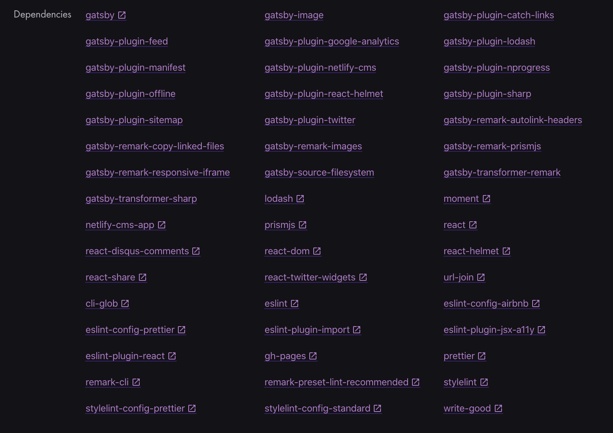
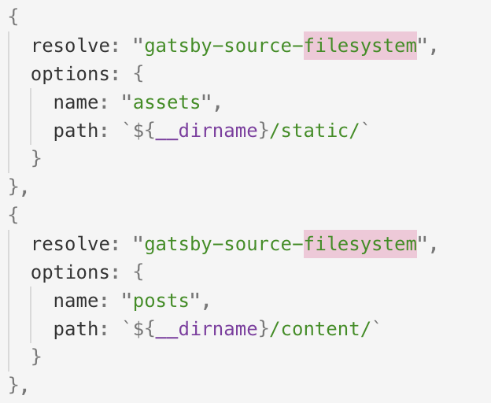

## NOTE! This article is composed for personal learning. Lots of explanations are very crude and some are just copy paste from the plugin page.

There are total 48 dependencies for the advanced starter. Even after crossing out obvious dependencies, such as `gatsby` and `react`, still 46 on the list. To better understand what each of them does, I’ve put them with simple words, sometimes just copy and paste with what’s described from their document. 

`gatsby-image` — Image processing plugin for the blog. Works with `gatsby-plugin-sharp` and `gatsby-transformer-sharp`. But it’s not fully replaceable for `` tag ;; `site-functionalities`

`gatsby-plugin-catch-links` — Make all uncaught local links by React behave with like `Link`. ;; `site-functionalities`

`gatsby-plugin-feed` — Add rss feed to the site ;; `site-functionalities`

`gatsby-plugin-google-analytics` — Add google analytics to th e site ;; `site-functinoalities`

`gatsby-plugin-lodash` — Adds the Lodash webpack & Babel plugins for easy modular, small Lodash builds. ;; `site-functionalities`

`gatsby-plugin-manifest` — As part of PWA(Progressive Web Apps) specification, the plugin provides information about an application (name, author, icon, description, etc) and goes further by doing extra stuffs such as icon generation, favicon support, localization, cache busting as well as legacy icon support (iOS). ;; `site-functionalities`

`gatsby-plugin-netlify-cms` — Plugin for Netlify CMS. ;; `site-functionalities`

`gatsby-plugin-nprogress` — Automatically shows nprogress indicator. You can set your color. ;; `site-functionalities`

`gatsby-plugin-offline` — By creating a service worker and loading it into a client, it makes the site work offline and more resistant to bad network. If there is `gatsby-plugin-manifest`, the offline plugin should be listed below the manifest plugin. ;; `site-functionalities`

`gatsby-plugin-react-helmet` — React Helmet helps you easily control your document head. It works by that nested or latter components override duplicate changes. For example, you want different metadata for each post of pages. React Helmet makes it easy by just surrounding the the document head with <Helmet></Helmet>. Post will have their own metadata which is great for SEO purpose. ;; `site-functionalities`

`gatsby-plugin-sharp` — Exposes several image processing functions built on Sharp image processing library. Used my `gatsby-image`. It’s is a low-level plugin so it is not recommended to use it directly. ;; `site-functionalities`

`gatsby-plugin-sitemap` — Create a sitemap for your gatsby site. It only works in production mode. ;; `site-functionalities`

`gatsby-plugin-twitter` — Loads the Twitter JavaScript for embedding tweets, timelines, share and follow buttons. Lets you add tweets to markdown and in other places. ;; `SNS`

`gatsby-remark-autolink-headers` — Adds GitHub-style hover links to headers in your markdown files when they’re rendered. This is a sub-plugin for `gatsby-transformer-remark`. ;; `markdown`

`gatsby-remark-copy-linked-files` — Copies local files linked to/from Markdown files to the root directory. This is a sub-plugin for `gatsby-transformer-remark` ;; `markdown`

`gatsby-remark-images` — A sub-plug in `gatsby-transformer-remark`, it process images in markdown so they can be used in the production build. Also it generates multiple sizes for images to ease downloading images for different devices and use “blur up” technique popularized by Medium. Since it is based on Sharp, JPEG and PNG are supported but not GIFs or SVGs. You have to specifcy maxWidth at its option. ;; `site-functionalities`

`gatsby-remark-prismjs` — Add synxtax highlighting to code blocks in markdown files using PrismJS. You have to add css theme for the PrismJS in your `gatsby-browser.js`. ;; `site-functionalities`

`gatsby-remark-responsive-iframe` — wraps iframes or object within markdown files in a responsive elastic container with a fixed ratio. This plugin requires both `width` and `height` attributes to be set. This is a sub-plugin for `gatsby-transformer-remark` ;; `site-functionalities`

`gatsby-source-filesystem` — A plugin for sourcing data into your Gatsby application from your local filesystem. It makes a `file` node and the node can be transformed into different nodes like JSON data nodes by other transformer plugin. For Advanced Starter, 

and you can query each filesystem using the name. ;; `site-functionalities`

`gatsby-transformer-remark` — It’s a plug that parses Markdown using Remark. You can look at demonstrations of sub-plugins [here](https://using-remark.gatsbyjs.org/). ;; `site-functionalities`

`gatsby-transformer-sharp` — A plugin to create `ImageSharp` nodes to be queried by GraphQL and processed later. You need a source plugin. ;; `site-functionalities`

`lodash` — A library to make working with arrays, numbers, objects, strings, etc easier ;; `Developing ease`

`moment` — A library to deal with dates. ;; `Developing ease`

`netlify-cms-app` — A library for netlify cms. ;; `site-functionalities`

`prismjs` — A library to highlight code blocks. You can see a working demo [here](https://using-remark.gatsbyjs.org/). ;; `site-functionalities`

`react-disqus-comments` — A library to add disqus comments to the site ;; `site-functionalities`

`react-dom` — A library that serves as the entry point to the DOM renderers for React ;; `Developing ease`

`react-helmet` — React Helmet helps you easily control your document head. It works by that nested or latter components override duplicate changes. For example, you want different metadata for each post of pages. React Helmet makes it easy by just surrounding the the document head with <Helmet></Helmet>. Post will have their own metadata which is great for SEO purpose. ;; `Developing ease`

`react-share` — A library to make share buttons for social networks and messangers ;; `SNS`

`react-twitter-widgets` A library to add twitter widget. ;; `SNS`

`url-join` — A library to join all url and its arguments and normalize the resulting url. ;; `Developing ease`

`cli-glob` — A glob cli to find files. ;; `Developing ease`

`eslint` — A tool to identify and report warning and errors on javascript code. ;; `Developing ease`

`eslint-config-airbnb` — ESLint configurations from Airbnb. ;; `Developing ease`

`eslint-config-prettier` — A package to turn off all rules that are unnecessary or might conflict with Prettier. ;; `Developing ease`

`eslint-plugin-import` — A plugin to support linting of ES2015+ import/export syntax. ;; `Developing ease`

`eslint-plugin-jsx-a11y` — A plugin to link eslint with jsx ;; `Developing ease`

`ESLint-plugin-React` — A React specific linting rules for ESLint. ;; `Developing ease`

`gh-pages` — A pacakge to publich files to `gh-pages` branch on Github ;; `Developing ease`

`prettier` — A code formatter for better readibility.;; `Developing ease`

`remark-cli` — A cli for remark. ;; `Developing ease`

`remark-preset-lint-recommended` — A remark preset to configure `remark-lin`. ;; `Developing ease`

`stylelint` — A linter ;; `Developing ease`

`stylelint-config-prettier` — A config to turn off all rules that might conflict with Prettier ;; `Developing ease`

`stylelint-config-standard` — An config that extends `stylelint` with following CSS style guides. ;; `Developing ease`

`write-good` — A linter for English. ;; `Developing ease`

